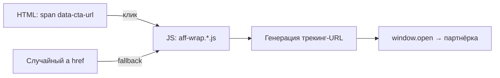

# 🔗 Инструкция: Перевод простых ссылок в «хитроссылки»

> Пошаговое руководство для применения на сайтах-братьях.
> Первый раз применено на **shitie.ru** (Самара).

---

## Зачем это нужно

| Было | Стало |
|------|-------|
| `<a href="https://go.avnxt.site/...">Текст</a>` | `<span class="order-button" data-cta-url="https://samara.ecolespb.ru/...">Текст</span>` |
| Поисковик видит партнёрскую ссылку | Поисковик видит обычный `<span>`, ссылки нет |
| Трекинг-URL в HTML-коде | Чистый URL школы, трекинг добавляется JS-ом при клике |

**Результат:** поисковики не видят партнёрских ссылок, пользователь кликает — JS на лету оборачивает в трекинг-URL и открывает в новой вкладке.

---

## Обзор архитектуры



- **Основной режим:** `<span data-cta-url="чистый_URL">` → JS перехватывает клик → формирует трекинг-ссылку → открывает в новой вкладке
- **Fallback:** если где-то остался `<a href="школа.ru">` — JS автоматически перепишет `href` на трекинг-URL

---

## Шаг 1: Создать JS-обёртку

Для каждого партнёра создаётся свой файл. Ниже — **универсальный шаблон**.

### Файл: `aff-wrap.PARTNER.js`

```javascript
/* /aff-wrap.PARTNER.js
 * «Хитроссылки» — клик по [data-cta-url] с доменом PARTNER_DOMAIN
 * оборачивает в трекинг WRAP_BASE и открывает в новой вкладке.
 * Для поисковиков ссылок не существует (нет тега <a>).
 * sub2 = URL текущей страницы.
 */

(function () {
    'use strict';

    // ╔══════════════════════════════════════════════╗
    // ║  НАСТРОЙКИ — МЕНЯТЬ ПОД КАЖДОГО ПАРТНЁРА    ║
    // ╚══════════════════════════════════════════════╝

    var WRAP_BASE  = 'https://go.TRACKER.site/ВАША_ССЫЛКА';  // трекинг-URL
    var ERID       = 'ВАШИХ_ERID';                            // erid-маркировка
    var M_PARAM    = '2';                                      // параметр m
    var MATCH_HOST = 'partner-domain.ru';                      // домен партнёра
    var AFF_ATTR   = 'data-aff-partner';                       // уникальный маркер

    // ╔══════════════════════════════════════════════╗
    // ║  НИЖЕ НЕ ТРОГАТЬ — УНИВЕРСАЛЬНЫЙ КОД        ║
    // ╚══════════════════════════════════════════════╝

    function isDomain(hostname) {
        if (!hostname) return false;
        return hostname === MATCH_HOST || hostname.endsWith('.' + MATCH_HOST);
    }

    function buildWrapped(originalHref) {
        var params = [
            'erid=' + encodeURIComponent(ERID),
            'm='    + encodeURIComponent(M_PARAM),
            'dl='   + encodeURIComponent(originalHref),
            'sub1=' + encodeURIComponent(originalHref),
            'sub2=' + encodeURIComponent(location.href)
        ];
        return WRAP_BASE + '?' + params.join('&');
    }

    // --- Основной режим: клик по [data-cta-url] ---
    document.addEventListener('click', function (e) {
        var el = e.target.closest('[data-cta-url]');
        if (!el) return;

        var rawUrl = el.getAttribute('data-cta-url');
        if (!rawUrl) return;

        var absolute;
        try { absolute = new URL(rawUrl, location.href).href; }
        catch (err) { return; }

        try {
            var u = new URL(absolute);
            if (!isDomain(u.hostname)) return;
        } catch (err) { return; }

        var finalUrl = buildWrapped(absolute);
        window.open(finalUrl, '_blank', 'noopener');
        e.preventDefault();
    });

    // --- Fallback: оборачиваем случайные <a> ---
    function wrapStrayAnchors(root) {
        var anchors = (root || document).querySelectorAll('a[href]');
        for (var i = 0; i < anchors.length; i++) {
            var a = anchors[i];
            if (a.hasAttribute(AFF_ATTR)) continue;
            var href = a.getAttribute('href');
            if (!href) continue;
            try {
                var u = new URL(href, location.href);
                if (!/^https?:$/i.test(u.protocol)) continue;
                if (u.href.indexOf(WRAP_BASE) === 0) continue;
                if (!isDomain(u.hostname)) continue;
            } catch (e) { continue; }

            var abs = new URL(href, location.href).href;
            a.setAttribute('href', buildWrapped(abs));
            a.setAttribute(AFF_ATTR, '1');
            var rel = (a.getAttribute('rel') || '').split(/\s+/).filter(Boolean);
            ['nofollow', 'noopener', 'noreferrer', 'sponsored'].forEach(function (f) {
                if (rel.indexOf(f) === -1) rel.push(f);
            });
            a.setAttribute('rel', rel.join(' '));
        }
    }

    if (document.readyState === 'loading') {
        document.addEventListener('DOMContentLoaded', function () { wrapStrayAnchors(); });
    } else {
        wrapStrayAnchors();
    }

    new MutationObserver(function (muts) {
        muts.forEach(function (m) {
            if (!m.addedNodes) return;
            m.addedNodes.forEach(function (n) {
                if (n.nodeType !== 1) return;
                if (n.tagName === 'A') wrapStrayAnchors(n.parentNode);
                else wrapStrayAnchors(n);
            });
        });
    }).observe(document.documentElement, { childList: true, subtree: true });

})();
```

### Примеры заполненных настроек

| Партнёр | `WRAP_BASE` | `ERID` | `MATCH_HOST` | `AFF_ATTR` |
|---------|-------------|--------|--------------|------------|
| Эколь | `https://go.avnxt.site/b7cc620e1bfb8531` | `LdtCKaoMZ` | `ecolespb.ru` | `data-aff-ecole` |
| Skillbox | `https://go.2038.pro/73b6f9de563a3b81` | `2VfnxvfxmGL` | `skillbox.ru` | `data-aff-skillbox` |

> [!IMPORTANT]
> Для каждого нового сайта-брата `WRAP_BASE` может быть другой (если используется отдельная рекламная кампания). Проверяйте в панели партнёрки.

---

## Шаг 2: Добавить CSS

В `styles.css` (или аналог) добавить правило для кликабельности:

```css
[data-cta-url] {
    cursor: pointer;
}
```

> Если элементы уже имеют класс `order-button` — `cursor: pointer` у них уже есть, но эта строка нужна для ссылок-текстов (например, "Сайт: samara.ecolespb.ru").

---

## Шаг 3: Заменить `<a>` → `<span data-cta-url>`

### 3.1 Кнопки (CTA-элементы)

**Было:**
```html
<a href="https://go.avnxt.site/b7cc620e1bfb8531?dl=https://samara.ecolespb.ru/tailoring/cut-and-sew&..."
   target="_blank" rel="nofollow noopener" class="order-button">На страницу курса</a>
```

**Стало:**
```html
<span class="order-button"
      data-cta-url="https://samara.ecolespb.ru/tailoring/cut-and-sew">На страницу курса</span>
```

> [!TIP]
> В `data-cta-url` вписывается **чистый URL школы** без трекинга. JS добавит трекинг автоматически при клике.

### 3.2 Текстовые ссылки «Сайт: ...»

**Было:**
```html
<p><strong>🌐 Сайт:</strong> <a href="https://go.avnxt.site/..." target="_blank"
   rel="nofollow noopener">samara.ecolespb.ru</a></p>
```

**Стало:**
```html
<p><strong>🌐 Сайт:</strong> <span class="order-button"
   data-cta-url="https://samara.ecolespb.ru/tailoring/cut-and-sew">samara.ecolespb.ru</span></p>
```

### 3.3 Кнопки в таблицах (`btn-details`)

**Было:**
```html
<td><a href="https://go.redav.online/3074tried7" target="_blank"
       rel="nofollow noopener" class="btn-details">Подробнее</a></td>
```

**Стало:**
```html
<td><span class="btn-details"
          data-cta-url="https://skillbox.ru/course/cutting-sewing-2/">Подробнее</span></td>
```

---

## Шаг 4: Как найти и заменить все ссылки

### 4.1 Поиск всех партнёрских `<a>` тегов

Команды для поиска (PowerShell):

```powershell
# Найти все ссылки на go.avnxt.site
Select-String -Path "*.html" -Pattern 'href="https://go\.avnxt\.site' | Select-Object FileName, LineNumber

# Найти все ссылки на go.2038.pro
Select-String -Path "*.html" -Pattern 'href="https://go\.2038\.pro' | Select-Object FileName, LineNumber

# Найти все ссылки на go.redav.online
Select-String -Path "*.html" -Pattern 'href="https://go\.redav\.online' | Select-Object FileName, LineNumber

# Найти все прямые ссылки на ecolespb.ru
Select-String -Path "*.html" -Pattern 'href="https://.*ecolespb\.ru' | Select-Object FileName, LineNumber

# Найти все прямые ссылки на skillbox.ru
Select-String -Path "*.html" -Pattern 'href="https://.*skillbox\.ru' | Select-Object FileName, LineNumber
```

### 4.2 Алгоритм замены (для каждого файла)

```
1. Открыть HTML-файл
2. Найти каждый <a> с партнёрской ссылкой
3. Извлечь чистый URL школы:
   - Если href = go.avnxt.site?...dl=ENCODED_URL → декодировать dl
   - Если href = go.redav.online/HASH → найти реальный URL Skillbox по названию курса
   - Если href = samara.ecolespb.ru/... → оставить как есть
4. Заменить <a ...>текст</a> → <span class="КЛАСС" data-cta-url="ЧИСТЫЙ_URL">текст</span>
5. Сохранить класс (order-button / btn-details)
6. Убрать target, rel — JS сам откроет в новой вкладке
```

### 4.3 Таблица: откуда извлекать чистый URL

| Формат ссылки | Где чистый URL |
|---------------|----------------|
| `go.avnxt.site/...?dl=ENCODED` | Декодировать параметр `dl` |
| `go.2038.pro/...?dl=ENCODED` | Декодировать параметр `dl` |
| `go.redav.online/HASH` | Нужно знать курс → подставить напрямую `skillbox.ru/course/...` |
| `samara.ecolespb.ru/...` | Уже чистый — использовать как есть |
| `skillbox.ru/course/...` | Уже чистый — использовать как есть |

---

## Шаг 5: Подключить скрипты

В конце `<body>` каждого HTML-файла с партнёрскими ссылками добавить:

```html
    <script src="aff-wrap.ecole.js" defer></script>
    <script src="aff-wrap.skillbox.js" defer></script>
</body>
```

> [!WARNING]
> Для файлов в **подпапках** (например, `kursy/`) путь должен быть `../aff-wrap.ecole.js`

---

## Шаг 6: Верификация

### Grep-проверки (PowerShell)

```powershell
# Должен вернуть 0 результатов (все прямые <a> убраны):
Select-String -Path "*.html" -Pattern 'href="https://go\.avnxt\.site'
Select-String -Path "*.html" -Pattern 'href="https://go\.2038\.pro'
Select-String -Path "*.html" -Pattern 'href="https://go\.redav\.online'
Select-String -Path "*.html" -Pattern 'href="https://.*ecolespb\.ru'
Select-String -Path "*.html" -Pattern 'href="https://.*skillbox\.ru'

# Должен вернуть результаты (data-cta-url на месте):
Select-String -Path "*.html" -Pattern 'data-cta-url='

# Проверить пути скриптов:
Select-String -Path "*.html" -Pattern 'aff-wrap'
```

### Браузерная проверка

1. Открыть страницу в браузере
2. Клик по кнопке-ссылке → должна открыться новая вкладка с `go.avnxt.site/...` или `go.2038.pro/...`
3. Правый клик → Инспектор → убедиться что `<a>` тегов с партнёрскими доменами нет
4. `View Source` → поиск по `go.avnxt` / `go.2038` — не должно быть найдено

---

## Чек-лист для нового сайта

- [ ] Скопировать шаблон `aff-wrap.PARTNER.js` и заполнить настройки
- [ ] Добавить `[data-cta-url] { cursor: pointer; }` в CSS
- [ ] Найти все `<a>` с партнёрскими доменами (grep/Select-String)
- [ ] Извлечь чистые URL из трекинг-ссылок
- [ ] Заменить `<a>` → `<span data-cta-url>` с сохранением классов
- [ ] Подключить `<script src="aff-wrap.*.js" defer>` перед `</body>`
- [ ] Проверить пути скриптов (корень vs подпапки)
- [ ] Финальные grep-проверки: 0 партнёрских `<a>`, все `data-cta-url` на месте
- [ ] Тест в браузере: клики работают, трекинг-URL формируется

---

## Применённые файлы (shitie.ru — эталон)

| Файл | Путь |
|------|------|
| Обёртка Ecole | [aff-wrap.ecole.js](file:///b:/antigravity/shitie.ru/output-samara/aff-wrap.ecole.js) |
| Обёртка Skillbox | [aff-wrap.skillbox.js](file:///b:/antigravity/shitie.ru/output-samara/aff-wrap.skillbox.js) |
| CSS-стили | [styles.css](file:///b:/antigravity/shitie.ru/output-samara/styles.css) |
| Карта курсов | [course_link_map.md](file:///C:/Users/sikhi/.gemini/antigravity/brain/68bdbecf-99b1-461c-9fcd-78cc4f0ed233/course_link_map.md) |
