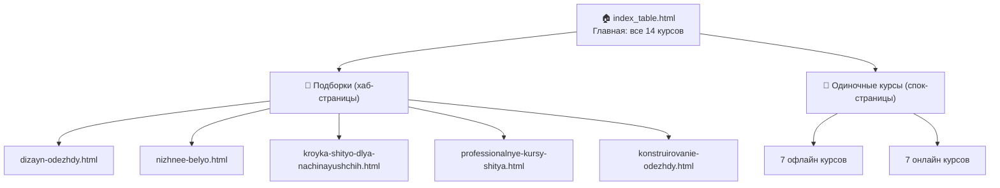

# Карта страниц и ключевых слов — shitie.ru/samara

## Структура сайта



---

## 📊 Таблица: страницы → ключевые слова

### Главная страница (уже готова)

| Страница | Ключевые слова |
|----------|---------------|
| **index_table.html** | `курсы шитья в самаре`, `курсы кройки и шитья в самаре`, `курсы кройки и шитья в самаре для начинающих`, `курсы шитья самара`, `школа шитья самара`, `курсы по шитью самара`, `курсы шитья в самаре для начинающих`, `курсы кройки и шитья самара` |

---

### Подборки (хаб-страницы)

| Страница | Title (H1) | Ключевые слова | Курсы внутри |
|----------|------------|---------------|--------------|
| **dizayn-odezhdy.html** | Курсы дизайна одежды в Самаре | `дизайн одежды курсы`, `курс дизайн одежды`, `курс по дизайну одежды`, `обучение дизайнер одежды`, `дизайнер одежды обучение`, `обучение дизайну одежды`, `курсы для дизайнеров одежды`, `курс на дизайнера одежды`, `курс дизайна одежды` | Дизайнер одежды (Эколь), Дизайнер одежды (Skillbox), Fashion-дизайнер (Skillbox) |
| **nizhnee-belyo.html** | Курсы пошива нижнего белья в Самаре | `курсы шитья нижнего белья`, `курс пошив нижнего белья`, `курсы по нижнему белью`, `курсы нижнего белья`, `обучение нижнее белье`, `школа нижнего белья`, `курсы шитья нижнего белья`, `дизайнер нижнего белья`, `курсы кройки и шитья нижнего белья`, `курсы по пошиву нижнего белья` | Дизайнер нижнего белья (Эколь), Дизайнер нижнего белья и купальников (Skillbox), Пошив нижнего белья и купальников (Skillbox) |
| **kroyka-shityo-dlya-nachinayushchih.html** | Курсы кройки и шитья для начинающих в Самаре | `курсы шитья для начинающих`, `курс кройки и шитья для начинающих`, `обучение кройки и шитья для начинающих`, `обучение шитью с нуля`, `курсы шитья с нуля`, `курс по шитью для начинающих`, `обучение шитью на швейной машинке с нуля курсы`, `базовый курс кройки и шитья`, `где научиться шить одежду`, `курсы шитья на машинке` | Кройка и шитьё: основы (Эколь), Кройка и шитьё (Skillbox), Пошив одежды с нуля до PRO (Skillbox) |
| **professionalnye-kursy-shitya.html** | Профессиональные курсы шитья в Самаре | `профессиональные курсы кройки и шитья`, `курсы пошива одежды`, `курсы по пошиву одежды`, `курсы по шитью одежды`, `курсы шитья одежды`, `курс по пошиву одежды`, `курс по шитью одежды`, `обучение пошиву одежды`, `обучение шитью` | Швея-портной (Эколь), Пошив одежды с нуля до PRO (Skillbox), Модельер-конструктор одежды (Эколь) |
| **konstruirovanie-odezhdy.html** | Курсы конструирования и моделирования одежды в Самаре | `курсы конструирования одежды`, `курс конструирования одежды`, `курсы конструирования и моделирования одежды`, `конструктор одежды обучение`, `обучение на конструктора одежды`, `курсы моделирования и конструирования одежды`, `моделирование одежды обучение`, `конструирование и моделирование одежды обучение`, `модельер конструктор одежды обучение`, `обучение модельер конструктор одежды`, `курсы модельера конструктора одежды`, `курсы конструирования`, `курсы моделирования и конструирования` | Модельер-конструктор (Эколь), Модельер-конструктор одежды (Эколь), Конструирование одежды (Skillbox) |

---

### Одиночные курсы — Офлайн (Эколь, Самара)

| Страница | Title (H1) | Ключевые слова |
|----------|------------|---------------|
| **kursy/kroyka-shityo-osnovy-ecole.html** | Курс «Кройка и шитьё: основы» в Самаре — Академия Эколь | `базовый курс кройки и шитья`, `курс кройки и шитья`, `курсы кройки и шитья в самаре`, `школа шитья самара`, `обучение кройки и шитья` |
| **kursy/modelier-konstruktor-ecole.html** | Курс «Модельер-конструктор» в Самаре — Академия Эколь | `модельер конструктор обучение`, `курсы модельера конструктора`, `модельер конструктор одежды обучение` |
| **kursy/dizayner-odezhdy-ecole.html** | Курс «Дизайнер одежды» в Самаре — Академия Эколь | `дизайнер одежды обучение`, `обучение дизайнер одежды`, `курс на дизайнера одежды` |
| **kursy/shveya-portnoy-ecole.html** | Курс «Швея-портной» в Самаре — Академия Эколь | `швея портной обучение`, `курсы швеи`, `профессия швея-портной` |
| **kursy/modelier-konstruktor-odezhdy-ecole.html** | Курс «Модельер-конструктор одежды» в Самаре — Академия Эколь | `профессия модельер конструктор одежды`, `специальность модельер конструктор одежды`, `модельер конструктор курсы` |
| **kursy/sozdanie-brenda-ecole.html** | Курс «Создание бренда одежды» в Самаре — Академия Эколь | `курс по созданию бренда одежды`, `курсы по созданию бренда одежды` |
| **kursy/dizayner-nizhnego-belya-ecole.html** | Курс «Дизайнер нижнего белья» в Самаре — Академия Эколь | `дизайнер нижнего белья`, `курсы нижнего белья`, `обучение нижнее белье` |

### Одиночные курсы — Онлайн (Skillbox)

| Страница | Title (H1) | Ключевые слова |
|----------|------------|---------------|
| **kursy/kroyka-shityo-skillbox.html** | Курс «Кройка и шитьё» от Skillbox — обучение онлайн | `курсы кройки и шитья`, `курс кройки и шитья`, `шитье курсы`, `курсы по кройке и шитью` |
| **kursy/poshiv-odezhdy-pro-skillbox.html** | Курс «Пошив одежды с нуля до PRO» от Skillbox | `курсы по пошиву одежды`, `обучение пошиву одежды`, `курсы пошива одежды`, `курс по шитью одежды` |
| **kursy/konstruirovanie-odezhdy-skillbox.html** | Курс «Конструирование одежды» от Skillbox | `курсы конструирования одежды`, `курс конструирования одежды`, `конструктор одежды обучение` |
| **kursy/dizayner-odezhdy-skillbox.html** | Курс «Дизайнер одежды» от Skillbox | `обучение дизайнер одежды`, `курсы для дизайнеров одежды`, `курс дизайн одежды` |
| **kursy/dizayner-belya-kupalnikov-skillbox.html** | Курс «Дизайнер нижнего белья и купальников» от Skillbox | `дизайнер нижнего белья`, `курсы по нижнему белью`, `курсы шитья нижнего белья` |
| **kursy/fashion-dizayner-skillbox.html** | Курс «Профессия Fashion-дизайнер» от Skillbox | `курс на дизайнера одежды`, `обучение дизайну одежды`, `курсы для дизайнеров одежды` |
| **kursy/poshiv-belya-kupalnikov-skillbox.html** | Курс «Пошив нижнего белья и купальников» от Skillbox | `курс пошив нижнего белья`, `курсы по пошиву нижнего белья`, `курсы кройки и шитья нижнего белья` |

---

## 📈 Итого по страницам

| Тип | Кол-во страниц | Ключевых слов (уникальных) |
|-----|---------------|---------------------------|
| Главная | 1 | ~8 |
| Подборки | 5 | ~50 |
| Одиночные курсы | 14 | ~45 |
| **ИТОГО** | **20 страниц** | **~100 ключей** |

> [!TIP]
> Из 420 ключей в `семантика.txt` около 30–40 запросов привязаны к Самаре, ещё ~60 — безгеошные (но применимы, т.к. пользователь ищет из Самары). Остальные — ключи других городов.

---

## 🔗 Схема перелинковки

```
Главная ←→ Подборки ←→ Курсы
  ↓            ↓          ↓
  └──── Хлебные крошки ───┘
```

- **Главная → подборки**: ссылки в тексте и в сайдбаре
- **Подборки → курсы**: карточки курсов со ссылками на детальные страницы
- **Курсы → подборки**: блок «Похожие подборки»
- **Курсы → главная**: хлебные крошки
